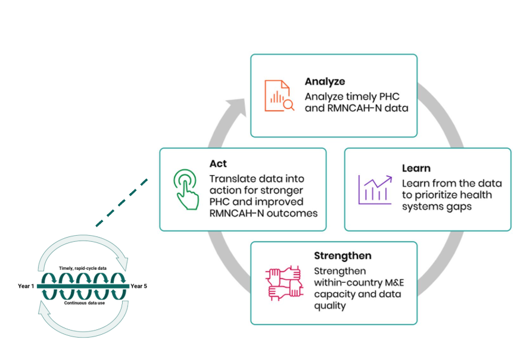

## What is FASTR?

An approach to catalyzing continuous 'analyze, learn, strengthen, act' cycles to drive the systematic use of timely data for decision making.

<!--
PRESENTER NOTES:
- Routine health information systems are a critical source of data, but often underused due to concerns about data quality and long delays between data collection and analysis
- Traditional household and facility surveys, while essential, are resource-intensive and infrequent
- FASTR's rapid-cycle analytics address this gap by providing:
  - Timely insights aligned with country decision cycles
  - Continuous learning rather than one-off assessments
  - Direct feedback loops between data, analysis, and action
-->
