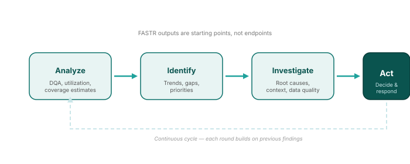

## From analysis to action

FASTR outputs — whether DQA scores, service use trends, or coverage estimates — are **starting points, not endpoints**. They trigger investigation and inform decisions.

<!--
PRESENTER NOTES:
- This cycle applies to ALL FASTR outputs, not just disruptions
- DQA findings → investigate data systems → improve reporting
- Utilization changes → investigate service delivery → address bottlenecks
- Coverage gaps → investigate access barriers → target interventions
- FASTR provides evidence; stakeholders provide context, judgement, and action
-->
