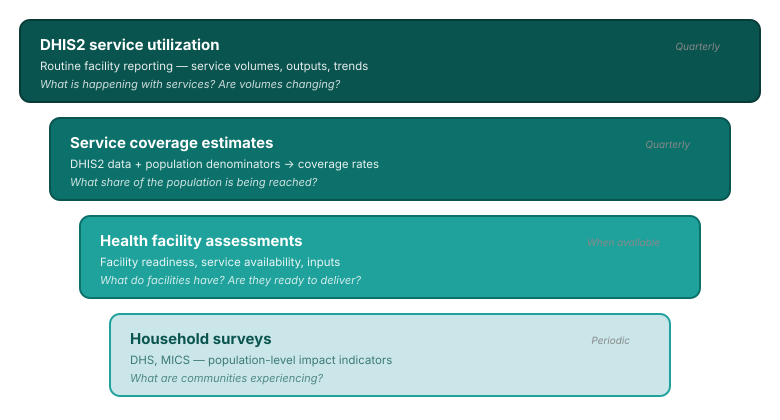

## Data triangulation: bringing together multiple sources

Each source answers different questions — together they tell the full story.

<!--
PRESENTER NOTES:
- DHIS2 is the foundation: available quarterly, covers all facilities
- Coverage estimates add the population perspective
- HFA and household surveys add depth when available
- Not every country has all sources — FASTR works with what's available
-->
