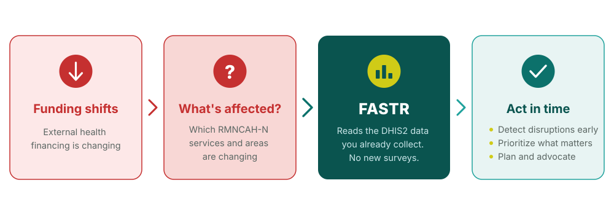

## Why now? Responding to disruptions in health financing

<!--
PRESENTER NOTES:
- This context applies to many countries right now — it's not hypothetical
- FASTR doesn't create new data collection — it maximizes use of existing DHIS2 data
- The goal is to move from reactive to proactive: see disruptions early, respond quickly
- Countries can use FASTR analyses to advocate for resources and inform planning
-->
