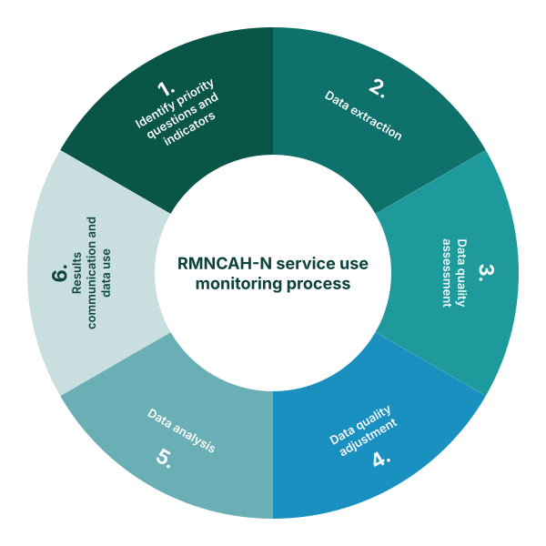

## What is the FASTR approach to RMNCAH-N service use monitoring?

Quarterly analyses of DHIS2 data, focusing on prioritized national indicators.

Building sustainable tools so that stakeholders who need to use data can generate the right analysis and visualizations, at the right time, on their indicators of interest.

Combining analysis and visualization with capacity strengthening and data-use support for sustainability and institutionalization.

<!--
PRESENTER NOTES:
- This is the methodology this workshop teaches. The other three pillars on the previous slide are introduced for context; this one is the meat of the next six modules.
- Quarterly cadence, prioritized indicators, sustainable tooling: those three points are the operating model.
- The diagram on the right is the journey for the rest of the workshop. Identify questions, extract data, assess quality, adjust for quality issues, analyze, communicate. Each step has its own module.
- Avoid going deep here. Point at the diagram and say "this is the rest of the workshop".
- If asked why quarterly: it matches the typical decision cycle for districts and ministries. Faster is possible but rarely useful; slower defeats the point.
-->
