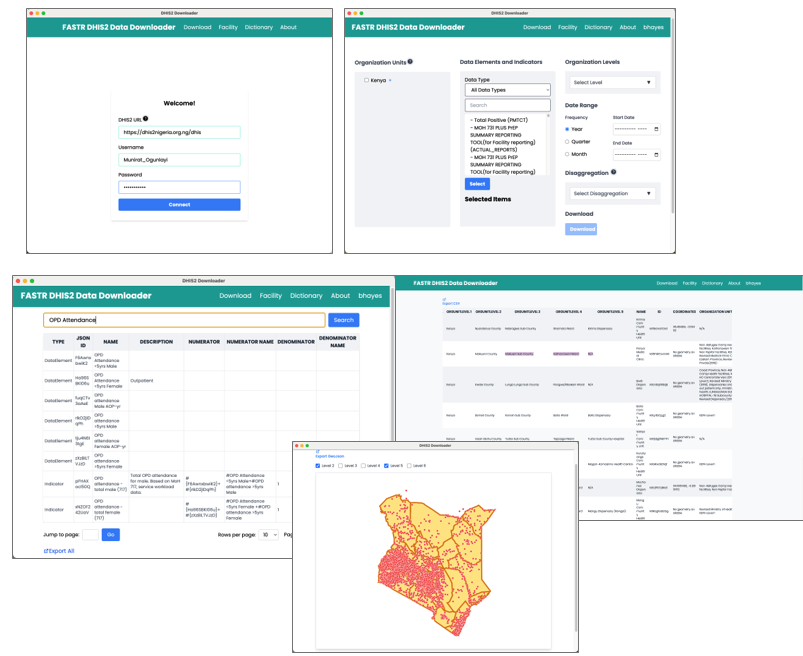

## Data extraction

We offer two tools for bulk DHIS2 data extraction: a user-friendly Data Downloader and a direct import feature within the FASTR analytics platform.

The Data Downloader provides a streamlined interface to download DHIS2 data. This tool is particularly useful to explore DHIS2 metadata and download indicators requiring disaggregated dimensions.

The Data Downloader is available at: https://github.com/worldbank/DHIS2-Downloader/releases/

