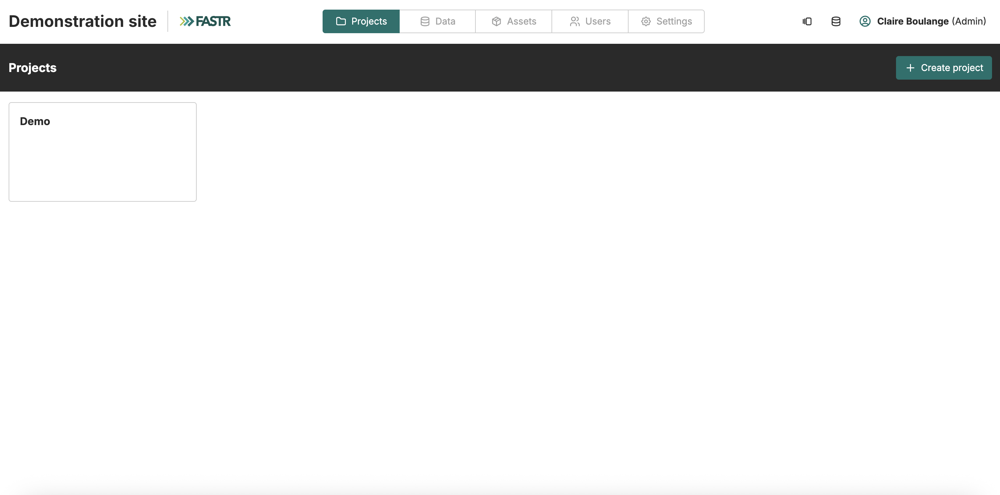
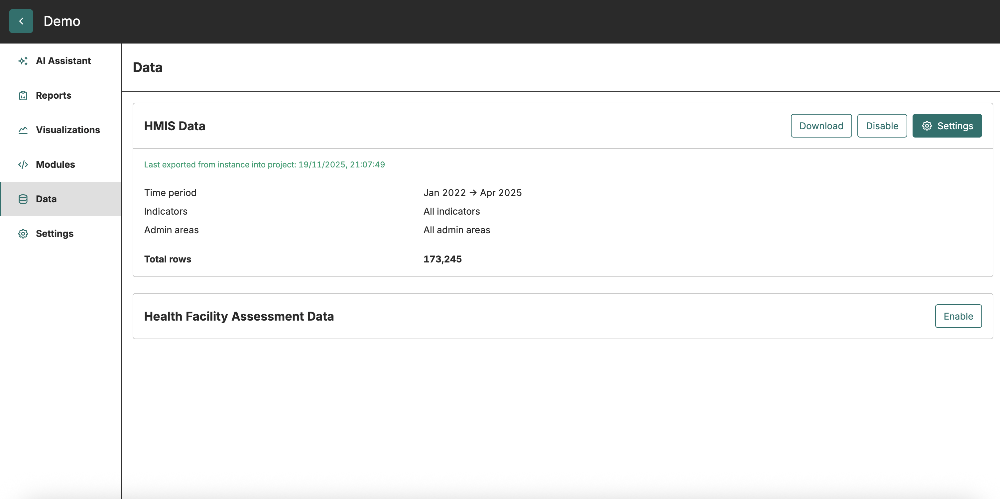
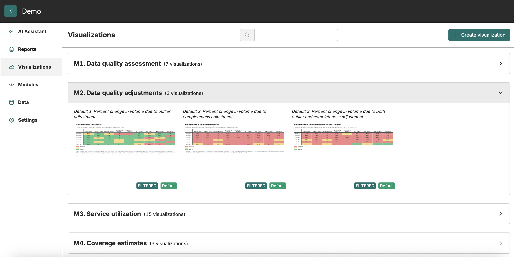

## FASTR analytics platform

The **FASTR analytics platform** is a web-based tool designed to support data quality assessment, adjustment, and analysis for routine health data.

It allows users to upload and analyze data from various sources, including DHIS2, with built-in statistical methods to generate an adjusted dataset and run priority analyses on selected indicators.

The platform provides a user-friendly interface for running analyses and offers flexible options for visualizing and exporting results.

  

