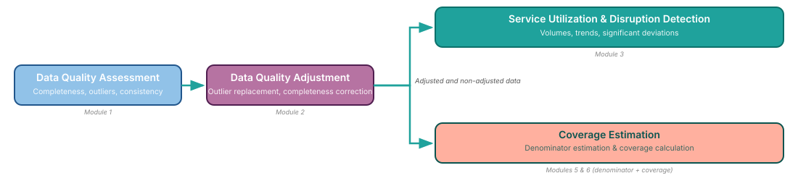

## FASTR analytical pipeline

FASTR runs through five sequential modules: **assess** data quality, **adjust** for the issues found, **analyze** adjusted service volumes, **build** target-population denominators, then **estimate** coverage.

We'll look at how each step works in turn.
