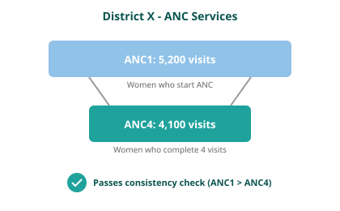

<!-- _class: dense-table -->

## Consistency between related indicators

Program indicators with a predictable relationship are examined to determine whether the expected relationship exists between them. In other words, this process examines whether the observed relationship between the indicators, as shown in the reported data, is that which is expected.

| Indicator pair | Expected relationship |
|----------------|----------------------|
| ANC1 / ANC4 | Ratio should be ≥ 0.95 |
| Penta1 / Penta3 | Ratio should be ≥ 0.95 |
| BCG / Facility delivery | Within 30% (≥0.7 and ≤1.3) |

We expect the number of pregnant women receiving a first ANC visit will always be higher than the number of pregnant women receiving a fourth ANC visit.

BCG is a birth dose vaccine so we expect that these indicators will be equal. However, we recognize there may be more variability in this predicted relationship thus we set a range of within 30%.

<!--
PRESENTER NOTES:
- Consistency checks logical relationships: ANC1 should always ≥ ANC4 (can't have 4th visit without 1st)
- We assess at DISTRICT level because patients move between facilities within a district
- Example: woman has ANC1 at health post, ANC4 at district hospital - still consistent at district level
- BCG vs deliveries allows 30% tolerance because not all births happen in facilities
- Ask: In your context, do patients commonly seek different services at different facilities?
-->
