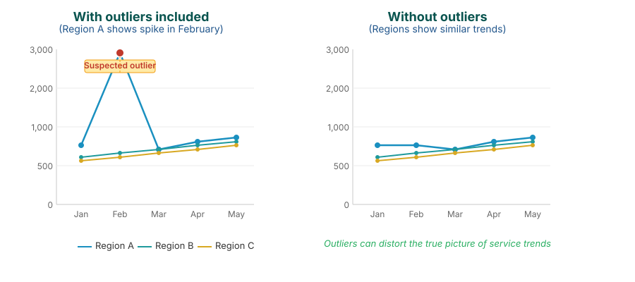

## Why adjust for outliers?

A single extreme value — say a 10× reporting spike caused by a data-entry error — can distort the underlying service trend for an entire facility. The chart shows the same data before and after outlier adjustment: the spike is removed, the underlying pattern is preserved.

<!--
PRESENTER NOTES:
- Left panel: raw data with the spike caused by the data-entry error.
- Right panel: same series after outlier adjustment using rolling averages.
- Key point: the trend is preserved, only the artefact is removed.
- This is the case for why downstream service-utilization and coverage estimates become more reliable.
-->
