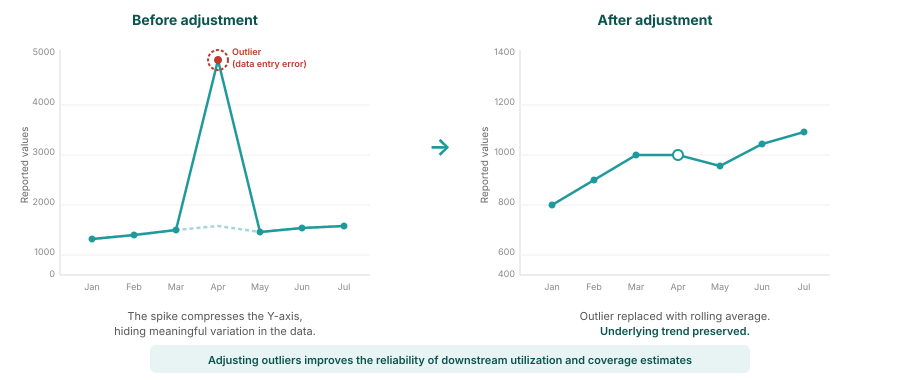

## Why adjust for outliers?

<!--
PRESENTER NOTES:
- Visual example showing the impact of outlier adjustment
- Left panel shows raw data with a spike caused by a data entry error
- Right panel shows the same data after outlier adjustment using rolling averages
- Key point: the underlying trend is preserved while the artificial spike is removed
- This makes downstream service utilization and coverage estimates more reliable
-->
