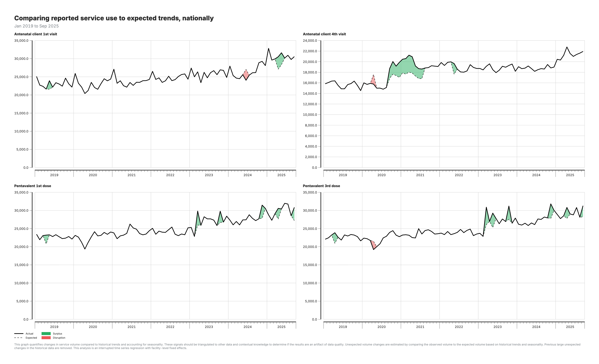
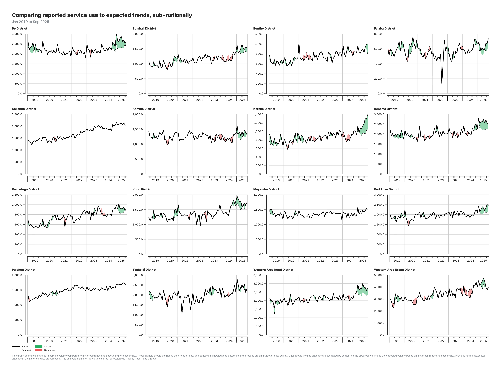

## Output: Actual vs expected (national)

National-level comparison of observed service volumes against expected values derived from historical trends and seasonal patterns.

---

## Output: Actual vs expected (subnational)

Subnational disaggregation enables identification of geographic areas where disruptions are concentrated.
