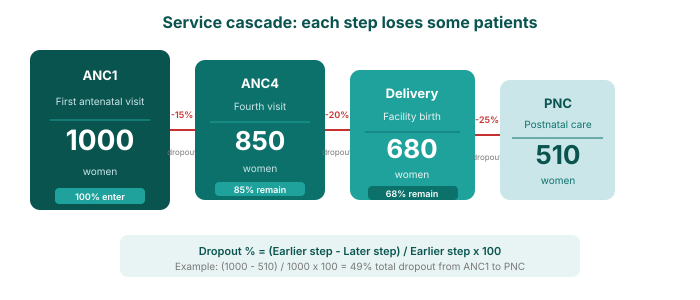

## Service cascade and dropout analysis

A service cascade shows the journey patients take through a series of related health services. At each step, some patients don't continue to the next one — this is called **dropout**.

For example, in maternal health: **ANC1 → ANC4 → Facility delivery → PNC**

Each step should ideally retain as many patients as possible, but in practice, numbers decrease along the way. Understanding where and why patients drop out helps target interventions.

