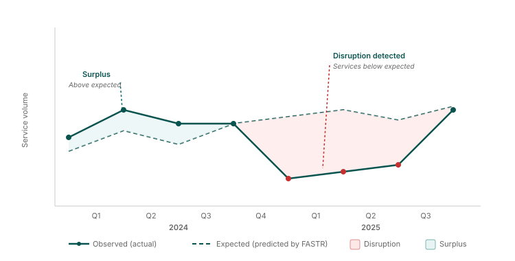

## Reading a disruption chart

<!--
PRESENTER NOTES:
- Black line = what actually happened (observed volumes)
- Dashed line = what FASTR expected (based on trend and seasonality)
- Red area = services were below expected (disruption)
- Green area = services were above expected (surplus)
- The size of the colored area = the magnitude of the impact
- Ask yourself: what caused this disruption? Was it a data problem or a real change?
-->
