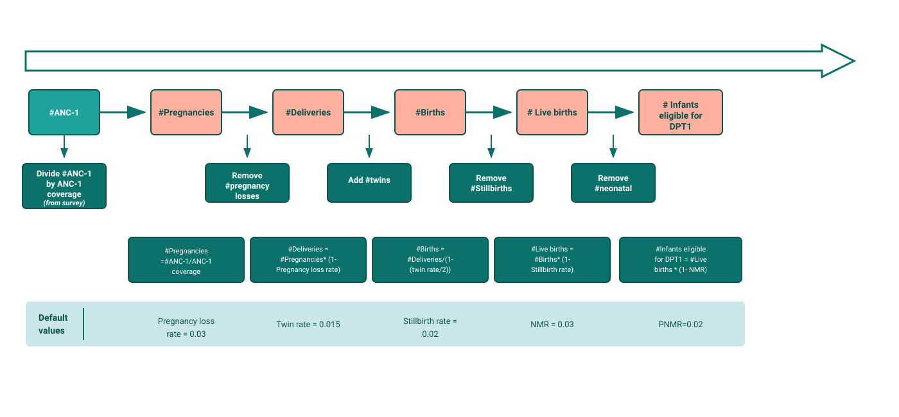
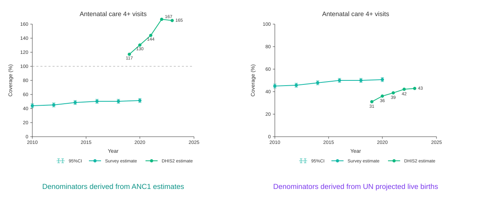

## Coverage: the denominator problem

The numerator is easy — it's what facilities report in DHIS2. But the **denominator** (how many people needed the service) is not in DHIS2.

A wrong denominator → coverage that exceeds 100% or doesn't reflect reality.

---

## How FASTR deduces the denominator from HMIS

FASTR starts from what facilities report and **works back up the chain** to estimate the target population for each indicator.

**Example**: the survey says 80% of pregnant women receive ANC1. The HMIS reports 10,000 ANC1 visits. → So there are roughly **10,000 ÷ 0.80 = 12,500 pregnancies**.

From there, FASTR calculates deliveries, births, live births, and eligible infants — adjusting for pregnancy losses, twins, stillbirths, etc.

---

## Not just ANC1 — multiple entry points

The formula is always the same: **HMIS volumes ÷ survey coverage = target population**

FASTR applies this formula with **4 different indicators**:

- **ANC1** ÷ ANC1 coverage → estimates **pregnancies**
- **Skilled birth attendance** ÷ SBA coverage → estimates **deliveries**
- **BCG** ÷ BCG coverage → estimates **live births**
- **Penta1** ÷ Penta1 coverage → estimates **DPT1-eligible infants**

Each estimate is independent. From each one, FASTR applies demographic adjustments (pregnancy losses, twins, stillbirths, neonatal deaths) to calculate all other populations.

FASTR tests all 4 chains and keeps the one that **best matches survey data** (DHS/MICS).

---

## Which denominator to choose?

The choice of denominator **completely changes** the results. Here is the same indicator (ANC4+) with two different denominators:

FASTR tests several denominators and keeps the one that **best matches national surveys** (DHS/MICS). For years without a survey, it projects estimates by following HMIS trends.
