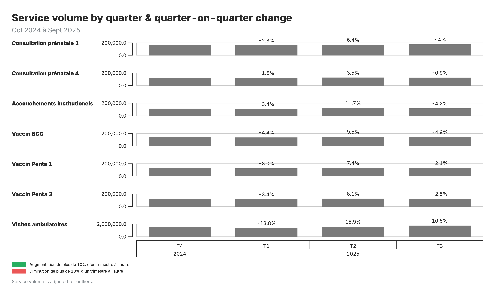

## Quarter-on-quarter change

**What you see:** Heatmap comparing current quarter to the previous quarter, with changes >±10% flagged.

**Formula:** QoQ change % = (current quarter – previous quarter) / previous quarter × 100

**Interpretation:** Flagged changes require follow-up — is this a real program change, data issue, or expected event?

<!--
PRESENTER NOTES:
- QoQ changes >±10% are flagged — but threshold is configurable
- For flagged changes, ask: data quality issue, real program change, or external event?
- These outputs don't require population denominators — useful when denominators uncertain
- Complementary to the year-over-year view: captures more recent changes
-->
