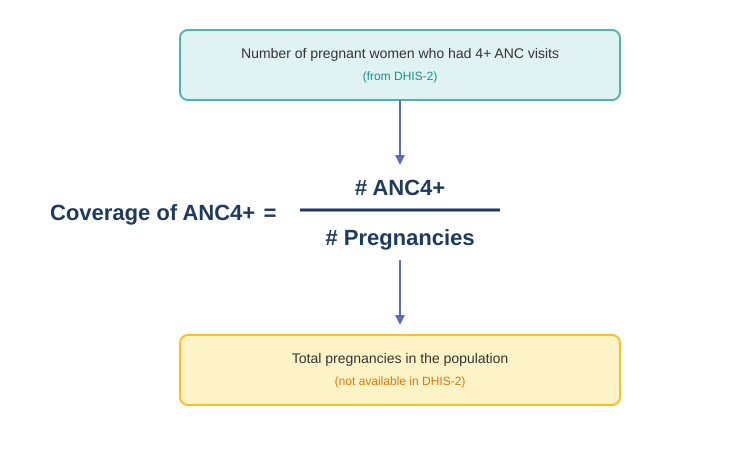

## What is coverage?

In plain language, **coverage** tells you what share of the people who needed a service actually received it. It is a percentage: services delivered divided by the target population, times 100.

A high coverage means the system is reaching most of who it should. A low coverage means people who needed the service did not get it — either it was not available, not accessible, or not used.

---

## Coverage: the denominator problem

The numerator is easy — it's what facilities report in DHIS2. But the **denominator** (how many people needed the service) is not in DHIS2. Without it, you can count services delivered but you cannot say what share of the population that represents.

---

## How FASTR deduces the denominator

FASTR works back up the chain to estimate the target population from what facilities already report.

**Example.** A survey says 80% of pregnant women receive ANC1. The HMIS reports 10,000 ANC1 visits. So there are roughly **10,000 ÷ 0.80 = 12,500 pregnancies** in that period.

From the pregnancy count, the demographic cascade gives deliveries, live births, and surviving infants — using country-specific rates for pregnancy losses, stillbirths, twins and infant mortality.

---

## Four parallel chains, best fit wins

ANC1 is not the only entry point. FASTR runs the same back-calculation from **four different services**:

- **ANC1** → estimates pregnancies
- **Skilled birth attendance** → estimates deliveries
- **BCG** → estimates live births
- **Penta1** → estimates DPT-eligible infants

Each entry point produces a complete cascade. FASTR then compares all four against UN World Population Prospects and **keeps the chain whose median ratio is closest to 1.0**. That selected chain is then applied uniformly to every indicator, so coverage estimates across the country are internally consistent.
