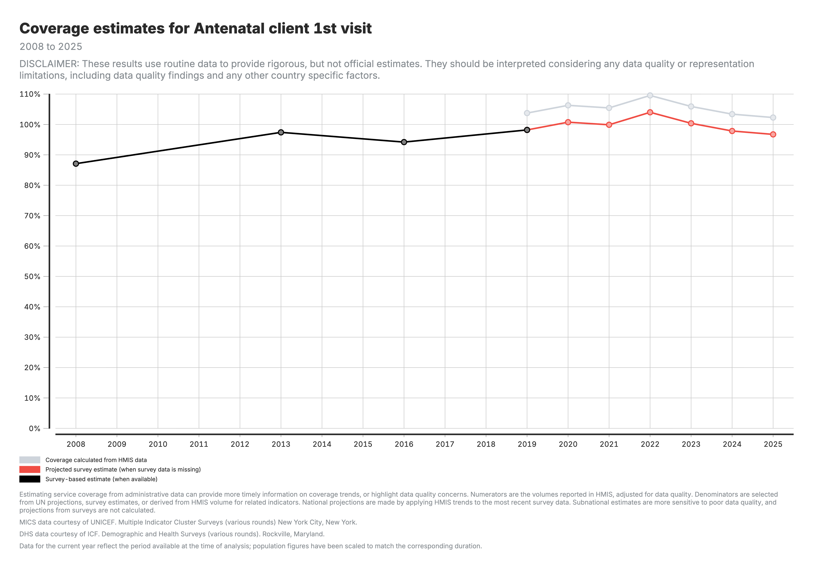

<!-- _class: output -->
## Coverage output: National trends

**What you see:** Line chart showing coverage over time. Black = survey, Grey = HMIS-derived, Red = projected.

**Formula:** Coverage % = (services / target population) × 100

**Interpretation:** Compare HMIS and survey values - large gaps suggest denominator issues. Projected values extend surveys using HMIS trends.

