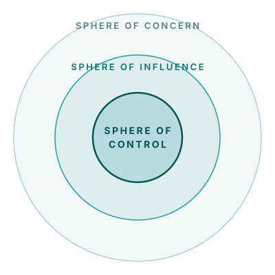

## Three spheres of influence

The Three Spheres framework directs attention to the actions you can actually take from your data.

**Sphere of control** — areas where you have full authority over your decisions.
*Defaulter tracing, register review, outreach coordination.*

**Sphere of influence** — actions you don't decide alone, but where you can still change the outcome.
*Engaging partners, securing logistics, advocating for policy.*

**Sphere of concern** — activities outside your control.
*National policy, external financing, population dynamics. Context to note, not actions to own.*

*Focus your action plans on what you control. Note influence and concern as context.*
