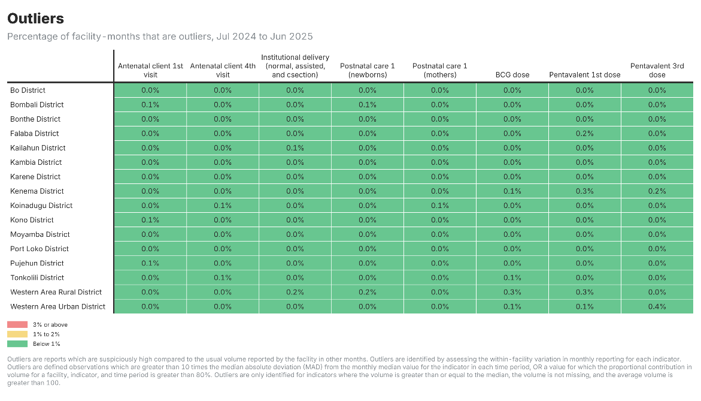

## When AI adds little value

**What you can see yourself:**

Across all districts, unusual values are very low — all indicators average below 1%. The data is being reported consistently.

***When the pattern is obvious, you don't need the AI to explain it.***

