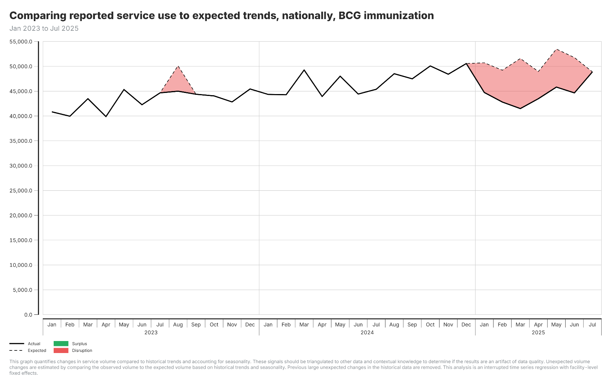

## When AI is helpful

**Your interpretation of figure:**

Multiple sustained disruptions through 2023 to 2025, with service use below expected levels during red shaded periods.

**AI interpretation of figure:**

In August 2023, volumes dropped significantly below expected levels (12% shortfall). Disruption intensified from January to May 2025, with February 2025 showing the largest gap at 10,100 cases (20% below expected).

***When patterns are not obvious, AI interpretation can improve our understanding.***

