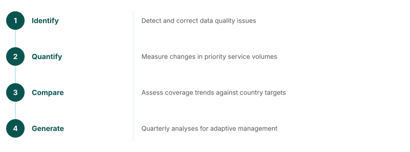

## RMNCAH-N service use analysis

### Core FASTR indicators

| Continuum of care | Indicators |
|---|---|
| **Maternal health** | ANC1, ANC4, institutional delivery, PNC1 |
| **Child health** | BCG, Penta1, Penta3 |
| **General monitoring** | Outpatient consultations |

<!--
Analysis of country HMIS data enables:
1. Identify and correct data quality issues
2. Quantify changes in priority service volumes
3. Compare trends in service coverage against country targets
4. Generate quarterly analyses for adaptive management
Countries add indicators tailored to their context and national priorities.
-->

---
