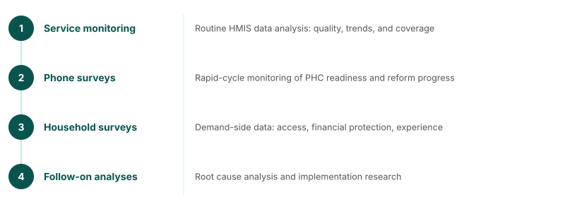

## FASTR at a glance

**Frequent Assessments and System Tools for Resilience**
*The GFF approach to rapid-cycle analytics and data use for stronger PHC systems and better RMNCAH-N outcomes*

Continuous cycle: **analyze** → **learn** → **strengthen** → **act**

<!--
Four technical approaches:
- Service use monitoring — Routine HMIS data analysis: data quality, trends, and coverage
- Health facility phone surveys — Rapid-cycle monitoring of PHC readiness and reform progress
- Household & client surveys — High-frequency demand-side data: access, financial protection
- Follow-on analyses — Root cause analysis and implementation research
-->

---
