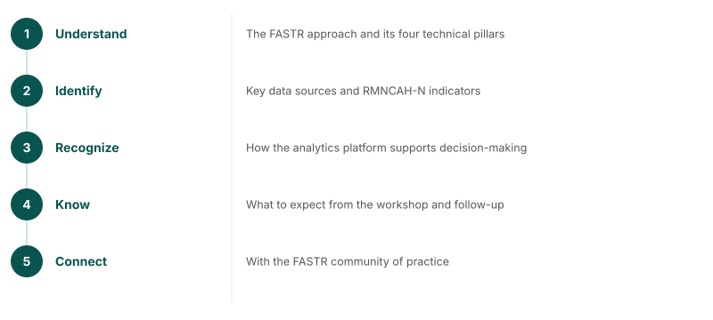

## Webinar objectives

<!--
By the end of this webinar, participants will be able to:
1. Understand the FASTR approach and its four technical pillars
2. Identify the key data sources and RMNCAH-N indicators
3. Recognize how the analytics platform supports decision-making
4. Know what to expect from the workshop and follow-up
5. Connect with the FASTR community of practice
-->

---
