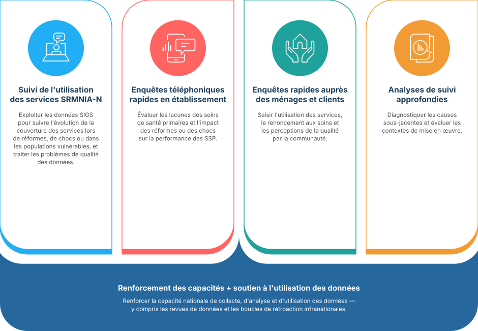

## Comment y parvenir ?

Des approches opportunes, rigoureuses et peu coûteuses pour le suivi des systèmes de **SSP** (Soins de Santé Primaires), soutenues par le renforcement des capacités et l'appui à l'utilisation des données, en adéquation avec la demande et les besoins des pays

