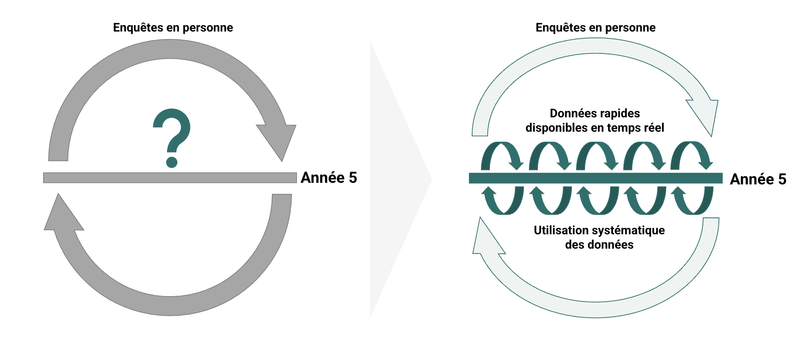

## Qu'essayons-nous d'accomplir ?

Les analyses à cycle rapide accélèrent les progrès de la SRMNIA-N en renforçant la disponibilité et l'utilisation systématique et rapide des données pour la prise de décisions stratégiques.

<!--
NOTES DU PRÉSENTATEUR :
- L'objectif de cette diapo est l'écart. Les données SIGS de routine sont disponibles maintenant ; les enquêtes en personne auprès des ménages et des établissements arrivent tous les cinq ans. Les décisions ne peuvent pas attendre la prochaine enquête.
- « Utilisation systématique et rapide des données » est l'objectif. « Rapide » est la partie facile. « Systématique » signifie que la revue des données devient une habitude, pas un événement ponctuel.
- Le diagramme oppose le modèle « enquête seule » (un point d'interrogation dans les années entre enquêtes) au modèle FASTR (des données continues et rapides en complément des enquêtes).
- Si on demande si FASTR remplace les enquêtes : non. FASTR comble les années intermédiaires et utilise les données d'enquête quand elles arrivent.
-->
