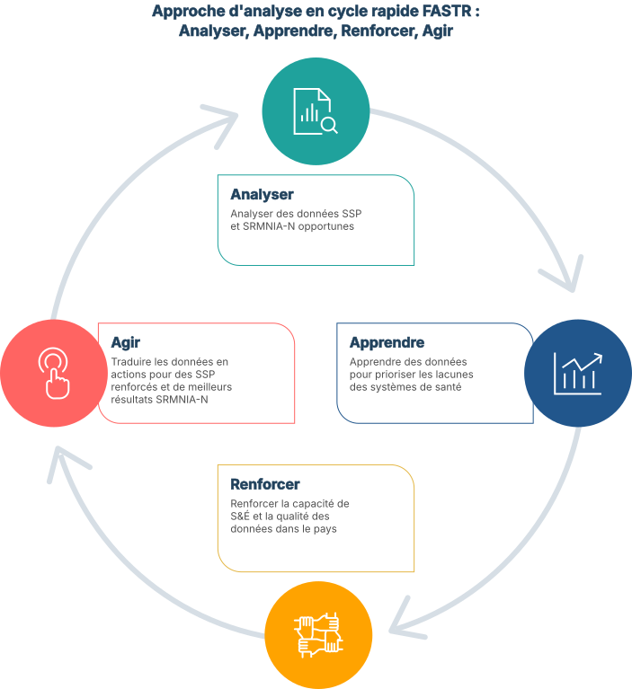

## Une approche : analyser, apprendre, renforcer, agir

FASTR catalyse des cycles continus d'analyse, d'apprentissage, de renforcement des systèmes et d'action, afin que des données disponibles à temps orientent les décisions à chaque niveau.

<!--
NOTES DU PRÉSENTATEUR :
- Énoncer le cycle à voix haute : analyser les données, apprendre ce qu'elles disent, renforcer le système à partir de ce que l'on a appris, agir sur les priorités, puis recommencer.
- Insister sur le caractère continu, pas ponctuel. Chaque tour de cycle doit laisser le système de données et les décisions un peu meilleurs que le précédent.
- Un seul rapport FASTR ne change pas la donne. Le cycle, oui. C'est pourquoi « systématique » compte autant que « rapide ».
- Si on demande quelle étape est la plus importante : les quatre. Sauter « renforcer » est le mode d'échec le plus fréquent ; l'analyse arrive mais le système ne s'améliore pas.
-->
