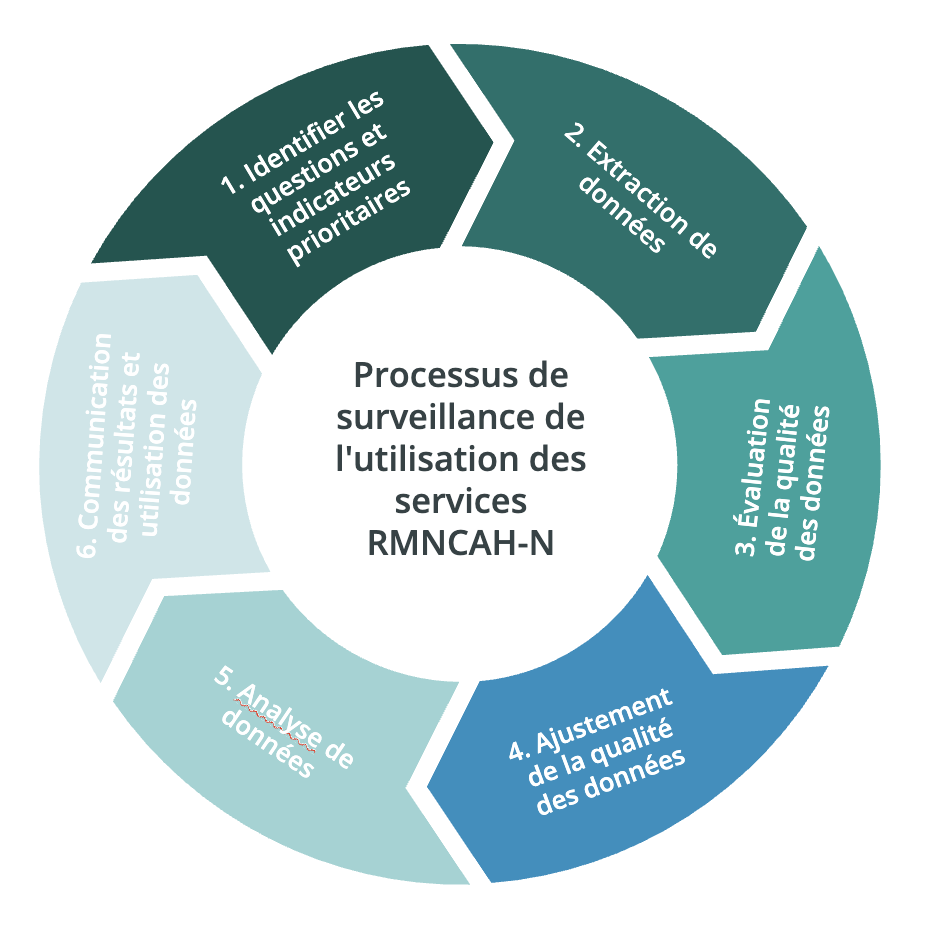

## Quelle est l'approche FASTR pour le suivi de l'utilisation des services SRMNIA-N ?

Analyses trimestrielles des données **DHIS2** (District Health Information Software 2), axées sur les indicateurs nationaux prioritaires

Développement d'outils durables pour garantir que les parties prenantes qui ont besoin d'utiliser les données puissent générer les analyses et visualisations appropriées, au bon moment, sur leurs indicateurs d'intérêt

Combinaison de l'analyse et de la visualisation avec le renforcement des capacités et l'appui à l'utilisation des données pour assurer la durabilité et l'institutionnalisation

