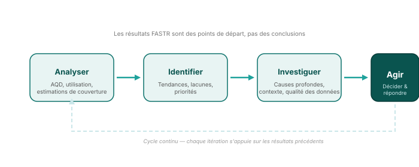

## De l'analyse à l'action

Les résultats de FASTR — qu'il s'agisse de scores AQD, de tendances d'utilisation des services ou d'estimations de couverture — sont des **points de départ, pas des conclusions**. Ils déclenchent l'investigation et éclairent les décisions.

<!--
PRESENTER NOTES:
- Ce cycle s'applique à TOUS les résultats de FASTR, pas seulement aux perturbations
- Résultats AQD → investiguer les systèmes de données → améliorer le rapportage
- Changements d'utilisation → investiguer la prestation de services → lever les obstacles
- Écarts de couverture → investiguer les barrières d'accès → cibler les interventions
- FASTR fournit les preuves ; les parties prenantes apportent le contexte, le jugement et l'action
-->
