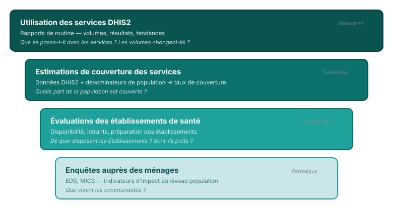

## Triangulation des données : combiner plusieurs sources

Chaque source répond à des questions différentes — ensemble, elles racontent l'histoire complète.

<!--
PRESENTER NOTES:
- Le DHIS2 est le fondement : disponible trimestriellement, couvre tous les établissements
- Les estimations de couverture ajoutent la perspective populationnelle
- Les EES et enquêtes ménages ajoutent de la profondeur quand elles sont disponibles
- Tous les pays ne disposent pas de toutes les sources — FASTR fonctionne avec ce qui est disponible
-->
