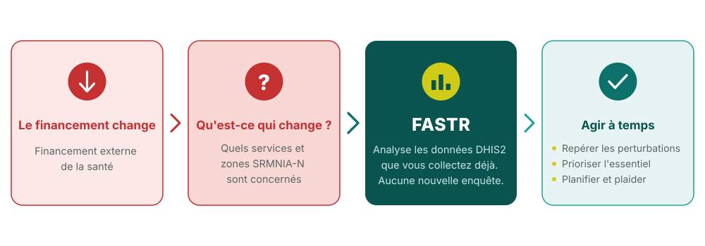

## Pourquoi maintenant ? Répondre aux perturbations du financement

<!--
PRESENTER NOTES:
- Ce contexte s'applique à de nombreux pays actuellement — ce n'est pas hypothétique
- FASTR ne crée pas de nouvelle collecte de données — il maximise l'utilisation des données DHIS2 existantes
- L'objectif est de passer de la réaction à la proactivité : voir les perturbations tôt, répondre rapidement
- Les pays peuvent utiliser les analyses FASTR pour plaider en faveur des ressources et éclairer la planification
-->
