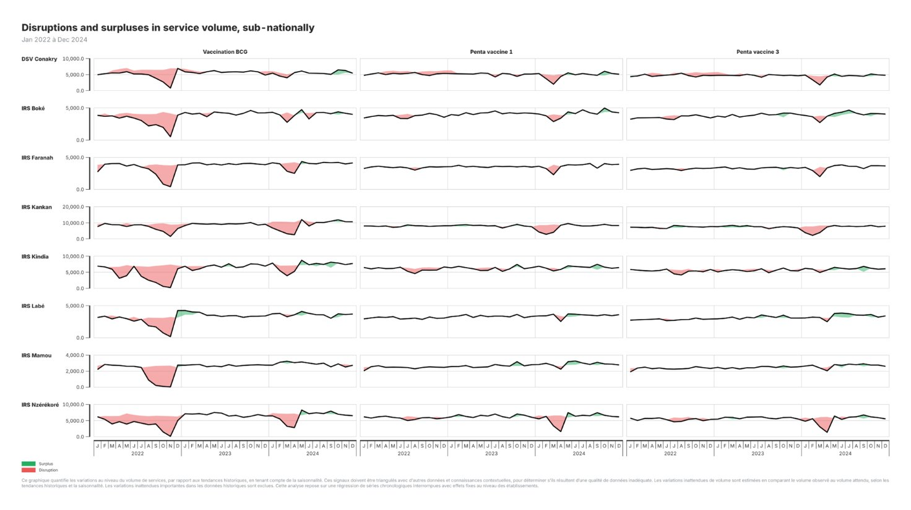

<!-- _class: compact -->
## Guinée : Suivi des progrès du dossier d'investissement

Le suivi trimestriel de l'utilisation des services SRMNIA-N a permis à la Guinée de suivre les progrès du dossier d'investissement et de repérer rapidement les difficultés -- comme cette forte baisse de la vaccination au début de 2024.

