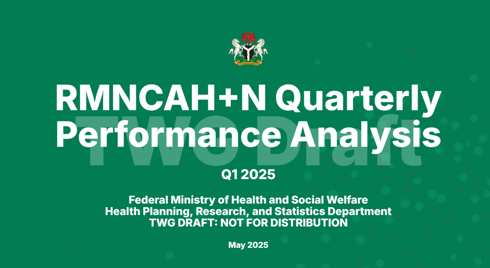
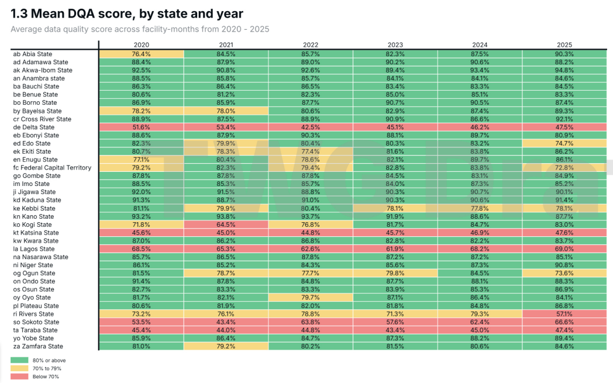

<!-- _class: two-panel -->
## Nigeria : Suivi trimestriel des performances

Au Nigeria, FASTR permet le suivi trimestriel des performances dans le cadre de l'Initiative nationale de renouvellement du secteur de la santé -- et contribue au renforcement des systèmes en parallèle.

<!-- _class: compact -->

> "Le processus FASTR devrait ouvrir des conversations sérieuses qui mèneront à des améliorations du système. Il ne s'agit pas de sélectionner un indicateur qui ne nous donnera pas de bonnes informations. Il s'agit d'utiliser ce processus FASTR pour prendre de meilleures décisions et réorganiser le système."
>
> — **Dr. Anthony Adoghe**, Directeur du suivi-évaluation, Ministère fédéral de la Santé et de la Protection sociale
