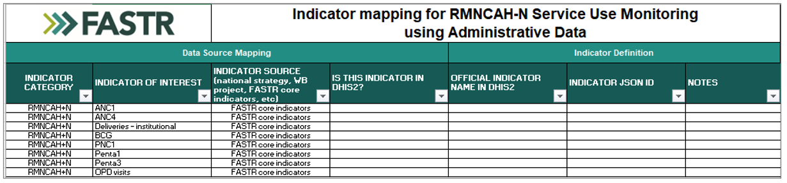

<!-- _class: columns-image-right -->

## Les pays ont sélectionné des indicateurs alignés sur le contexte des perturbations et les priorités nationales

- La liste de contrôle de préparation des données FASTR a été partagée avec les pays
- La liste comprend les indicateurs de base SRMNIA-N du FASTR
- Les pays ont ajouté des indicateurs supplémentaires pertinents pour leur contexte (par exemple, services touchés par les changements de financement, priorités gouvernementales)
- Ce sont les indicateurs inclus dans l'analyse actuelle
- Les pays peuvent continuer à ajouter des indicateurs au fil du temps selon leurs besoins
