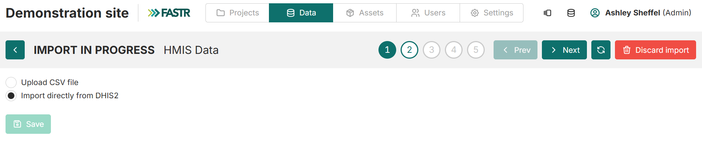
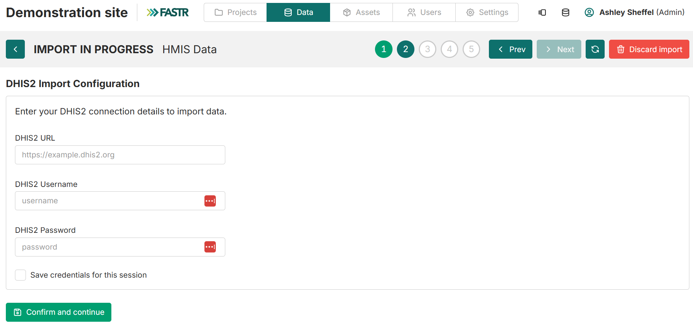

## Extraction des données

La **plateforme analytique FASTR** contient une fonction d'importation directe pour importer automatiquement les données du DHIS2. C'est souvent l'approche la plus simple une fois que les indicateurs ont été identifiés pour inclusion dans la plateforme.

