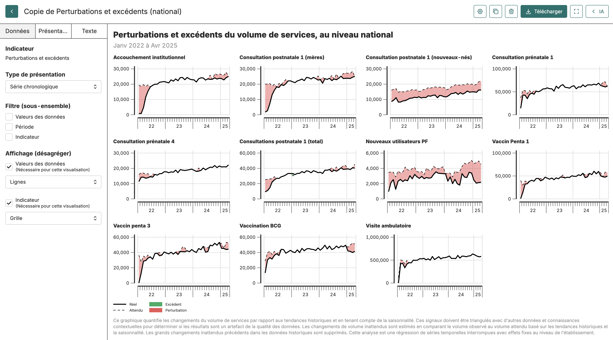
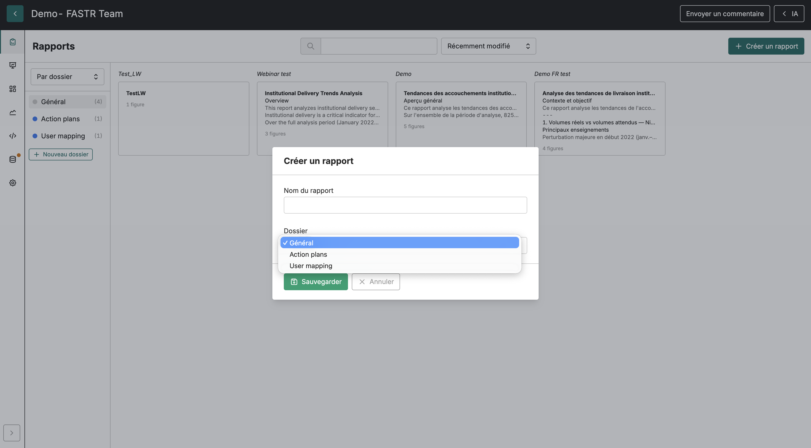
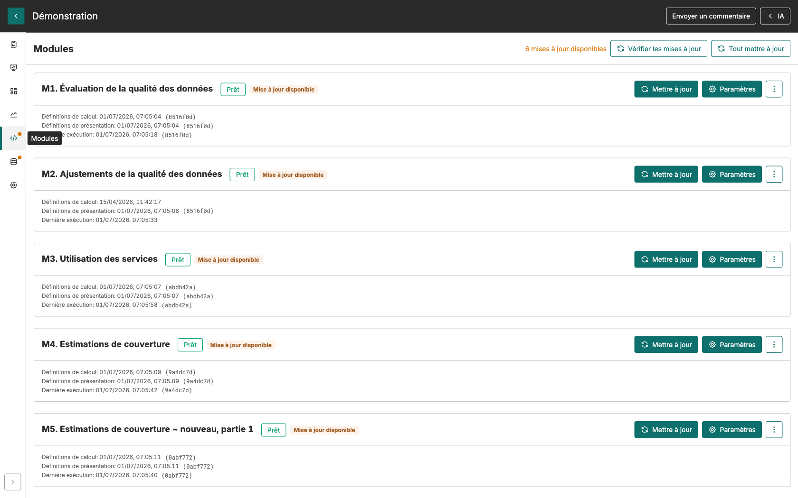

## Plateforme d'analyse FASTR

La **plateforme d'analyse FASTR** est un outil en ligne conçu pour faciliter l'évaluation de la qualité, l'ajustement et l'analyse des données de santé courantes.

Elle permet aux utilisateurs de télécharger et d'analyser des données provenant de diverses sources, y compris DHIS2, grâce à des méthodes statistiques intégrées permettant de générer un ensemble de données ajustées et d'effectuer des analyses prioritaires sur des indicateurs sélectionnés.

La plateforme offre une interface conviviale pour effectuer des analyses et propose des options flexibles pour visualiser et exporter les résultats.

  

