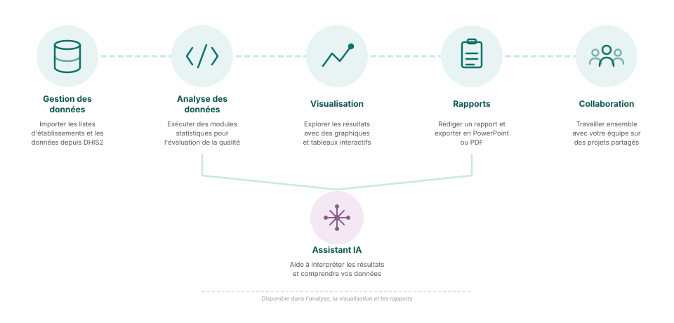

## Capacités de la plateforme

**Gestion des données** — Importer les listes d'établissements et les données d'indicateurs depuis DHIS2 ou fichiers

**Analyse des données** — Exécuter des modules statistiques pour l'évaluation et l'ajustement de la qualité

**Visualisation** — Explorer les résultats avec des graphiques et tableaux interactifs

**Rapports** — Exporter les résultats en PowerPoint ou PDF pour les parties prenantes

**Collaboration** — Travailler ensemble avec votre équipe sur des projets partagés

**Assistant IA** — Obtenir de l'aide pour interpréter les résultats et comprendre vos données

