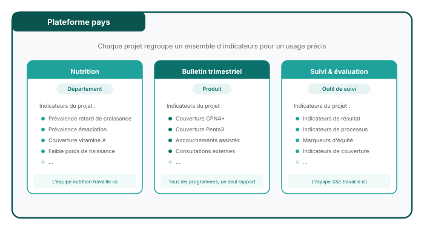

## Projets au sein d'une instance

Chaque instance de pays peut contenir **plusieurs projets**.

Un pays peut n'avoir besoin que d'un seul projet, ou plusieurs projets peuvent être utilisés pour :

- Différentes versions d'analyses
- Un projet de démonstration ou de test
- Des projets distincts pour différentes équipes ou différents programmes

**Questions clés lors de la mise en place :**

- Qui est l'administrateur ?
- Qui peut modifier ?
- Qui peut consulter ?

