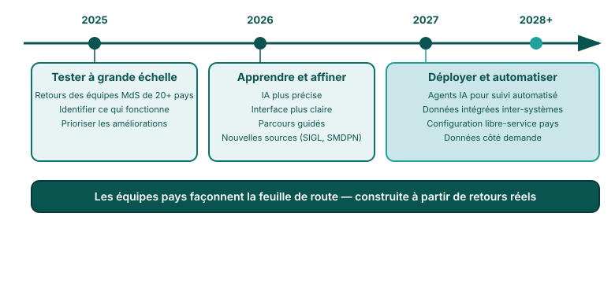

## Feuille de route de la plateforme

<!--
PRESENTER NOTES:
- La plateforme évolue en fonction des retours réels des utilisateurs
- Nous ne construisons pas en isolation — les équipes pays façonnent la feuille de route
- L'élargissement des sources de données signifie des analyses plus riches sans changer les flux de travail
- L'objectif à long terme : les pays peuvent mener leurs propres analyses de manière autonome
-->
