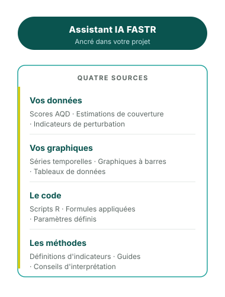

## Comment fonctionne l'assistant IA

L'IA suit un principe de « lire avant de répondre » — elle ne devine jamais.

**Pour les questions sur les données** (ex: « Comment la couverture CPN a-t-elle évolué ? ») :

1. Trouve la métrique pertinente dans votre projet
2. Lit les valeurs réelles des données
3. Répond en fonction de ce qu'elle a lu, avec une visualisation

**Pour les questions méthodologiques** (ex: « Comment les valeurs aberrantes sont-elles détectées ? ») :

1. Consulte la documentation pertinente
2. Lit les détails méthodologiques
3. Explique en langage clair

