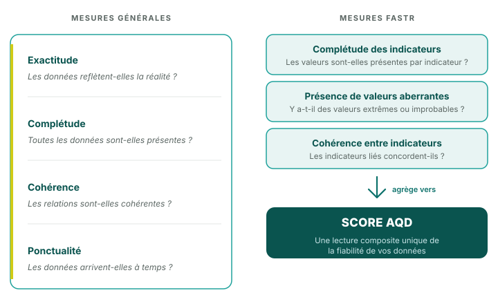

## Mesures de la qualité des données

<!--
PRESENTER NOTES:
- Complétude de l'indicateur - complétude
- Valeurs aberrantes - cohérence
- Cohérence entre indicateurs connexes - cohérence
- Exactitude - nécessite une collecte de données supplémentaire
- Ponctualité - importante pour les améliorations de routine de la qualité des données mais non pertinente pour l'analyse FASTR à un moment donné
-->
