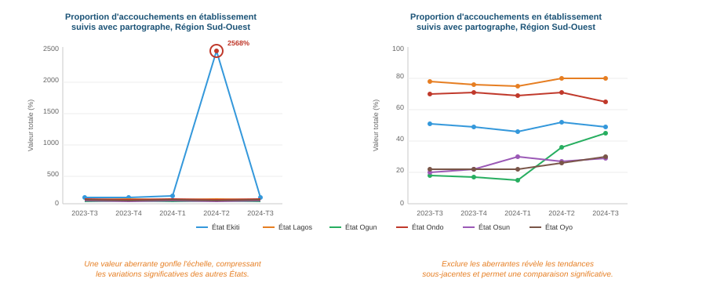

## Valeurs aberrantes

La présence de valeurs aberrantes permet de déterminer si un point de données d'une série de valeurs est extrême (anormalement élevé ou bas) par rapport aux autres points de la série.

Les valeurs aberrantes peuvent être le résultat de changements dans les activités programmatiques (comme une campagne intensifiée) ou peuvent être des problèmes de qualité des données.

Pour l'analyse FASTR, nous identifions les valeurs aberrantes qui sont des valeurs anormalement élevées par rapport au volume habituel de services déclarés par l'établissement (par exemple, les valeurs faibles ne sont pas identifiées comme des valeurs aberrantes dans l'analyse FASTR).

<!--
PRESENTER NOTES:
- La présence de valeurs aberrantes examine si un point de données dans une série de valeurs est extrême (anormalement élevé ou bas) par rapport aux autres de la série
- Les valeurs aberrantes peuvent résulter de changements dans les activités programmatiques (comme une campagne intensifiée) ou peuvent être des problèmes de qualité des données
- Pour l'analyse FASTR, nous identifions les valeurs aberrantes qui sont des valeurs anormalement élevées par rapport au volume habituel de services déclarés par l'établissement (les valeurs faibles ne sont pas identifiées comme valeurs aberrantes dans l'analyse FASTR)
- Les valeurs aberrantes sont identifiées en évaluant la variation au sein de l'établissement des rapports mensuels pour chaque indicateur
- Une valeur aberrante est définie comme : Une valeur supérieure à 10 fois l'écart absolu médian (EAM) par rapport à la valeur médiane mensuelle de l'indicateur pour chaque période, OU une valeur pour laquelle la contribution proportionnelle en volume pour un établissement, un indicateur et une période est supérieure à 80%
- ET pour laquelle : Le volume est supérieur ou égal à la médiane, le volume n'est pas manquant, et le volume est supérieur à 100
-->

---

## Pourquoi ajuster pour les valeurs aberrantes ?

---

## Méthodologie de détection des valeurs aberrantes

Les valeurs aberrantes sont identifiées en évaluant la variation au sein de l'établissement des rapports mensuels pour chaque indicateur.

Une valeur aberrante est définie comme :

Une valeur supérieure à **10 fois l'écart absolu médian (EAM)** par rapport à la valeur médiane mensuelle de l'indicateur pour chaque période, **OU** une valeur pour laquelle la contribution proportionnelle en volume pour un établissement, un indicateur et une période est **supérieure à 80 %**

**ET** pour laquelle :

- Le volume est **supérieur ou égal à la médiane**
- Le volume est **non manquant**
- Le volume est **supérieur à 100**

<!--
PRESENTER NOTES:
- Pour l'analyse FASTR, la période considérée pour identifier les valeurs aberrantes en utilisant l'approche EAM couvre l'ensemble du jeu de données. Cela signifie que si le jeu de données comprend cinq ans de données, la valeur médiane pour chaque indicateur sera calculée sur l'ensemble de la période de cinq ans
- Pour l'analyse FASTR, l'approche d'allocation proportionnelle pour identifier les valeurs aberrantes est appliquée sur une base d'année civile. Cela signifie que toutes les données de l'année 2024 seront utilisées pour évaluer la contribution proportionnelle des volumes de services déclarés en 2024. Si l'analyse est effectuée en milieu d'année, seules les données disponibles jusqu'à ce point seront considérées, ce qui peut conduire à l'utilisation de données d'une année partielle dans l'évaluation
- Cela restreint l'analyse FASTR aux valeurs aberrantes qui sont des valeurs anormalement élevées par rapport au volume habituel de services déclarés par un établissement
- Les données manquantes d'un système DHIS2 peuvent être dues à l'absence de déclaration ou à la déclaration de zéro service fourni (les zéros ne sont souvent pas stockés dans DHIS2). Nous ne pouvons pas distinguer entre manquant dû à l'absence de déclaration et manquant dû à la déclaration de zéro service. En tant que tel, les valeurs manquantes sont exclues de l'analyse
- Nous restreignons la détection des valeurs aberrantes aux volumes de services supérieurs à 100 car cela aide à se concentrer sur des données significatives, stables et opérationnellement importantes. Cela réduit le bruit dû à la volatilité des petits volumes et se concentre sur les valeurs aberrantes plus impactantes (par exemple, les grands volumes sont susceptibles d'avoir des implications plus significatives sur l'analyse)
-->
