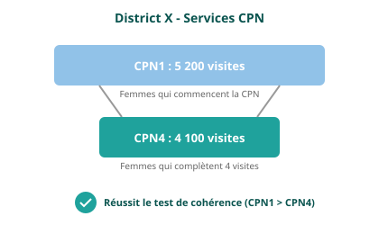

<!-- _class: dense-table -->

## Cohérence entre les indicateurs connexes

Les indicateurs du programme ayant une relation prévisible sont examinés afin de déterminer si la relation attendue existe entre eux. En d'autres termes, ce processus examine si la relation observée entre les indicateurs, telle qu'elle apparaît dans les données rapportées, est celle qui est attendue.

| Paire d'indicateurs | Relation attendue |
|----------------|----------------------|
| CPN1 / CPN4 | Le rapport doit être ≥ 0,95 |
| Penta1 / Penta3 | Le rapport doit être ≥ 0,95 |
| BCG / Accouchement en établissement | Dans les 30 % (≥0,7 et ≤1,3) |

Nous nous attendons à ce que le nombre de femmes enceintes recevant une première visite CPN soit toujours supérieur au nombre de femmes enceintes recevant une quatrième visite CPN.

Le BCG est un vaccin administré à la naissance, nous nous attendons donc à ce que ces indicateurs soient égaux. Cependant, nous reconnaissons qu'il peut y avoir plus de variabilité dans cette relation prédite, nous définissons donc une fourchette de 30 %.

<!--
PRESENTER NOTES:
- Les vérifications de cohérence examinent les relations logiques : CPN1 doit toujours être ≥ CPN4 (on ne peut pas avoir une 4ème visite sans la 1ère)
- Nous évaluons au niveau du DISTRICT car les patients se déplacent entre les établissements au sein d'un district
- Exemple : une femme fait sa CPN1 au poste de santé, sa CPN4 à l'hôpital de district - toujours cohérent au niveau du district
- BCG vs accouchements permet une tolerance de 30% car tous les accouchements n'ont pas lieu dans les établissements
- Question : Dans votre contexte, les patients cherchent-ils couramment différents services dans différents établissements ?
-->
