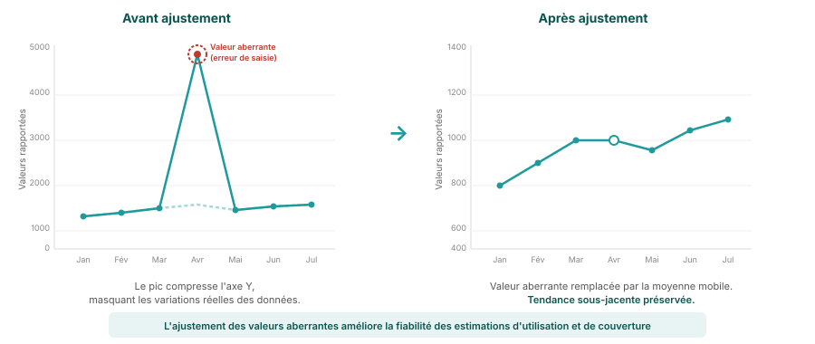

## Pourquoi ajuster les valeurs aberrantes ?

<!--
PRESENTER NOTES:
- Exemple visuel montrant l'impact de l'ajustement des valeurs aberrantes
- Le panneau de gauche montre les données brutes avec un pic causé par une erreur de saisie
- Le panneau de droite montre les mêmes données après ajustement en utilisant des moyennes mobiles
- Point clé : la tendance sous-jacente est préservée tandis que le pic artificiel est supprimé
- Cela rend les estimations d'utilisation des services et de couverture plus fiables
-->
