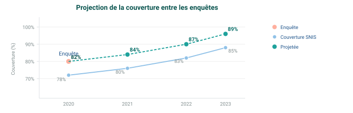

## Méthodologie de projection de la couverture

Le module projette la valeur de l'enquête la plus récente en utilisant les tendances observées dans la couverture dérivée du SIGS :

Les changements d'une année sur l'autre (deltas) dans la couverture SIGS sont calculés et appliqués à la dernière valeur de l'enquête. Cette approche préserve la base de référence de l'enquête tout en incorporant les tendances observées en matière de prestation de services.

<!--
PRESENTER NOTES:
- Les enquêtes sont peu fréquentes (3-5 ans) - il faut combler les lacunes
- Méthode de projection : dernière valeur d'enquête + tendance SIGS depuis l'enquête
- Formule : Projetée = Base d'enquête + (SIGS actuel - SIGS année d'enquête)
- Préserve le calibrage par rapport à l'enquête tout en incorporant les changements observés
- L'approche additive évite les erreurs cumulées
- Les projections doivent être validées lorsque de nouvelles données d'enquête sont disponibles
- Plus le temps depuis l'enquête est long = projection moins fiable
-->
