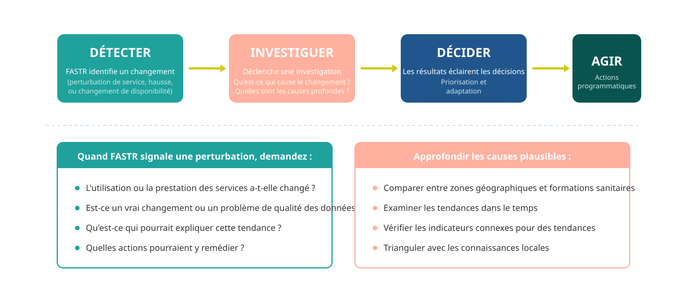

## Pourquoi détecter les perturbations est important

La détection des perturbations ne consiste pas seulement à signaler des problèmes — elle déclenche une investigation sur les causes profondes.

