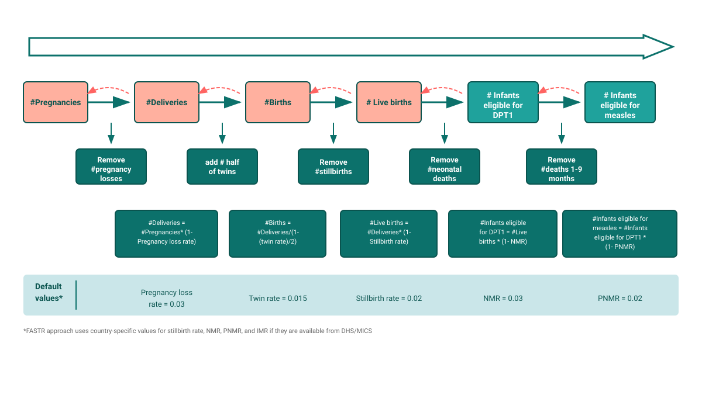

## Relations attendues qui aident à estimer les dénominateurs

<!--
PRESENTER NOTES:
La cascade démographique montre comment les populations se transforment au fil des étapes de vie
- Commencer par les grossesses → appliquer la perte de grossesse → accouchements
- Accouchements → ajuster pour les jumeaux → naissances
- Naissances → soustraire les mort-nés → naissances vivantes
- Naissances vivantes → soustraire les décès néonataux → éligibles au DTC
- Éligibles au DTC → soustraire les décès post-néonataux → éligibles à la rougeole
- Chaque étape utilise des taux de mortalité spécifiques au pays
- Cette logique fonctionne dans les deux sens (avant et arrière)

Formules clés :
- Gross = Acc/(1-TPG)
- Acc = Gross*(1-TPG)
- TN = Acc/(1-0.5*TJ)
- Acc = TN*(1-0.5*TJ)
- TN = NV/(1-TMN)
- NV = TN*(1-TMN)
- Gross = (NV*(1-0.5*TJ))/((1-TMN)*(1-TPG))

Au niveau provincial, nous utilisons toutes les valeurs par défaut !
-->
