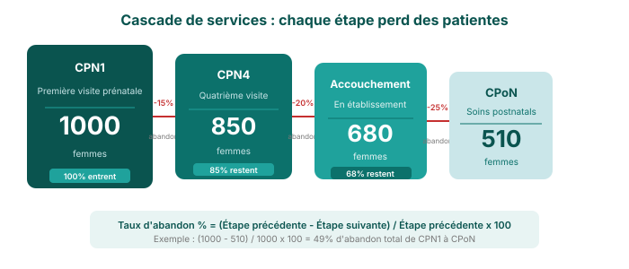

## Cascade de services et analyse de l'abandon

Une cascade de services montre le parcours que suivent les patients à travers une série de services de santé liés. À chaque étape, certains patients ne passent pas à l'étape suivante — c'est ce qu'on appelle l'**abandon**.

Par exemple, en santé maternelle : **CPN1 → CPN4 → Accouchement en établissement → Soins postnatals**

Idéalement, chaque étape devrait retenir le plus de patients possible, mais en pratique, les nombres diminuent en cours de route. Comprendre où et pourquoi les patients abandonnent aide à cibler les interventions.

---

## Calculer et interpréter l'abandon

**Formule de l'abandon :**

> Taux d'abandon % = (Étape précédente - Étape suivante) / Étape précédente × 100

**Exemple :** Si 1 000 femmes assistent à la CPN1 mais seulement 700 complètent la CPN4 :

> Abandon = (1 000 - 700) / 1 000 × 100 = **30 %**

**Échelle d'interprétation :**

| Taux d'abandon | Interprétation |
|---|---|
| < 10 % | Excellent — forte continuité des soins |
| 10–25 % | Acceptable — à surveiller régulièrement |
| 25–50 % | À approfondir — identifier les obstacles |
| > 50 % | Critique — nécessite une action immédiate |

**Essayez :** Trouvez les données Penta1 et Penta3 pour votre région. Quel est le taux d'abandon ? Qu'est-ce qui pourrait l'expliquer ?
