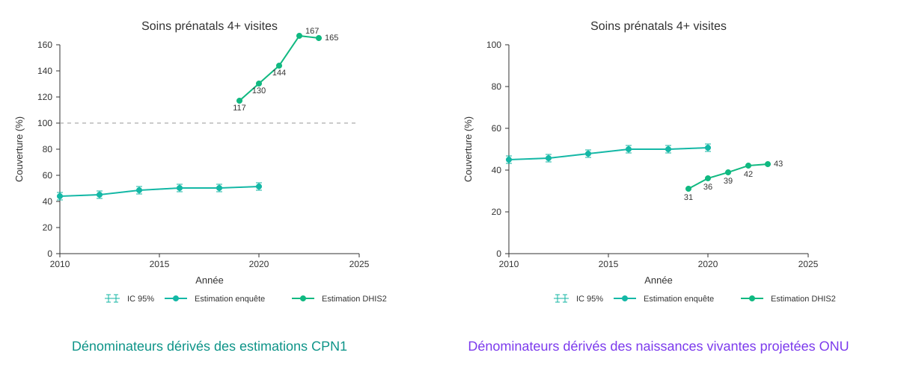

## Couverture : le problème du dénominateur

Le numérateur est facile — c'est ce que les formations sanitaires rapportent dans le DHIS2. Mais le **dénominateur** (combien de personnes avaient besoin du service) n'est pas dans le DHIS2.

Un mauvais dénominateur → une couverture qui dépasse 100% ou qui ne reflète pas la réalité.

---

## Comment FASTR déduit le dénominateur à partir du HMIS

FASTR part de ce que les formations sanitaires rapportent et **remonte la chaîne** pour estimer la population cible de chaque indicateur.

**Exemple** : l'enquête dit que 80% des femmes enceintes font une CPN1. Le HMIS rapporte 10 000 CPN1. → Donc il y a environ **10 000 ÷ 0,80 = 12 500 grossesses**.

À partir de ce chiffre, FASTR calcule les accouchements, naissances, naissances vivantes, et nourrissons éligibles — en ajustant pour les pertes de grossesse, les jumeaux, les mort-nés, etc.

---

## Pas seulement la CPN1 — plusieurs points d'entrée

La formule est toujours la même : **volumes HMIS ÷ couverture enquête = population cible**

FASTR applique cette formule avec **4 indicateurs différents** :

- **CPN1** ÷ couverture CPN1 → estime les **grossesses**
- **Accouchement assisté** ÷ couverture SBA → estime les **accouchements**
- **BCG** ÷ couverture BCG → estime les **naissances vivantes**
- **Penta1** ÷ couverture Penta1 → estime les **nourrissons éligibles DTC1**

Chaque estimation est indépendante. À partir de chacune, FASTR applique les ajustements démographiques (pertes de grossesse, jumeaux, mort-nés, décès néonatals) pour calculer toutes les autres populations.

FASTR teste les 4 chaînes et garde celle qui **colle le mieux aux enquêtes** (EDS/MICS).

---

## Quel dénominateur choisir ?

Le choix du dénominateur change **complètement** les résultats. Voici le même indicateur (CPN4+) avec deux dénominateurs différents :

FASTR teste plusieurs dénominateurs et garde celui qui **colle le mieux aux enquêtes nationales** (EDS/MICS). Pour les années sans enquête, il projette les estimations en suivant les tendances du HMIS.
