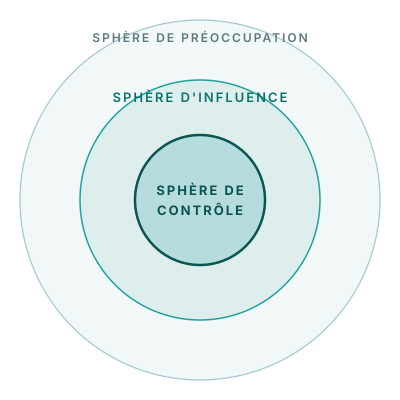

## Les trois sphères d'influence

Le cadre des trois sphères d'influence aide à orienter l'attention vers les actions que nous pouvons tirer de nos données.

**Sphère de contrôle** — domaines dans lesquels vous avez un contrôle total sur vos actions et vos décisions.
- Suivi des perdues de vue, revue des registres, coordination des activités de proximité
- Dans la capacité immédiate de votre équipe

**Sphère d'influence** — actions et décisions qui ne sont pas totalement sous votre contrôle, mais où vous avez le pouvoir de changer les résultats.
- Mobiliser les partenaires, sécuriser la logistique, plaider pour des changements de politique
- Vous pouvez influencer sans décider seul

**Sphère de préoccupation** — activités sur lesquelles vous n'avez aucun contrôle.
- Environnement politique national, financement externe, dynamique de la population
- Souvent des actions menées par d'autres, ou les conséquences en cascade à travers le système
- Contexte important, mais hors de votre portée directe

*Lorsque vous planifiez des actions à partir de vos résultats FASTR, concentrez-vous d'abord sur ce que vous contrôlez, puis sur ce que vous pouvez influencer.*
